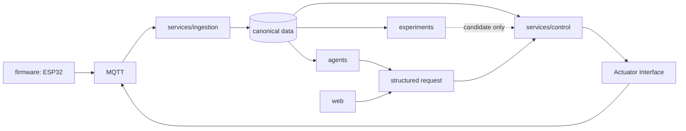

# 目标架构

## 分层模型



## 节点演进与实现定位

当前生产资产中的 `soil1`、`soil2`、`soil3` 不是等权的平行副本。它们记录了当前控制系统的迭代脉络：

```text
soil1（基础采集 / Phase1 探索 / 控制流程验证）
  → soil2（预测、控制与人工交互增强）
    → soil3（当前最完整的参考实现）
```

`soil3` 是后续识别和设计公共能力的优先参考来源，包含当前最完整的 Phase1、Phase2、Phase3、安全约束、OpenClaw 交互、Agent 接口以及审计与反馈能力。`soil1`、`soil2` 则作为历史实验和设备适配记录保留。

该演进关系不表示：

- soil1/soil2 可以被删除、覆盖，或自动升级为 soil3；
- soil3 的阈值、时长、MQTT Topic、学习参数或运行 state 可以复制到其他设备；
- 任何现存模块已经完成公共化。

在未来得到逐项验证后，才可从 soil3 提炼不含设备私有状态的通用能力；在此之前，导入代码仍按设备目录保存，以维持来源可追溯性。

## 权限边界

- `services/ingestion`：接收、校验、记录 MQTT 事件；不是泵仲裁器。
- `services/control`：维护 Phase 生命周期并执行最终自动安全决策。
- `Actuator Interface`：未来唯一的生产泵命令发布接口；其设计与迁移另行审查。
- `agents/`、`web/`、`experiments/`：只能生成结构化建议或请求，不能绕过控制安全层直接发布泵命令。
- `firmware/`：应实现设备端的命令校验、超时关闭、断线安全与回执；当前生产证据仍待补齐。

## 目标目录

```text
docs/       manifest/    services/    agents/      modules/
firmware/   web/         experiments/ dataset/     config/
deployment/ scripts/     tests/
```

目录会随受控导入按需创建。目录中出现源码只表示已整理的来源基线，不表示已经部署，也不改变 openEuler 的生产行为。
