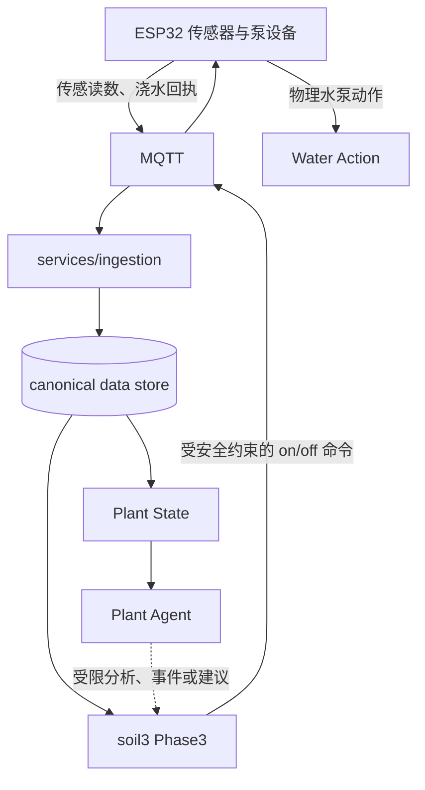

# 核心数据流

本文件说明当前仓库中可追溯的数据与控制关系。它描述工程边界，不代表所有模块都已在新仓库部署或验证。

## 模块说明

| 阶段 | 当前实现 | 输入 | 输出 | 作用 |
| --- | --- | --- | --- | --- |
| 设备感知 | ESP32（固件尚未纳入仓库） | 传感器与设备状态 | MQTT 传感/浇水消息 | 连接真实土壤、水泵与网络 |
| 消息接入 | `services/ingestion/mqtt_direct_gauss.py` | 设备 MQTT Topic 与 payload | 规范传感、灌溉、泵命令审计事件 | 接收、规范化、缓冲并写入数据存储 |
| 规范数据 | `soil_sensor_readings`、`irrigation_events`、`pump_command_events` 等契约 | 接入层事件 | 可查询的设备时间序列和审计记录 | 后续控制、状态和研究的共同数据事实源 |
| Plant State | `agents/plant_agent/plant_state_builder.py` | 规范传感数据、灌溉/人工事件、Phase3 状态摘要 | 每设备植物状态、健康/安全/学习摘要 | 为 Agent 与人类解释提供结构化上下文 |
| Plant Agent | `agents/plant_agent/` | Plant State、趋势、视觉/事件等受限输入 | 分析、解释、结构化事件或建议 | 不拥有自动泵执行权 |
| Phase3 | `services/control/phase3/soil3/` | 规范数据、控制状态、配置、受限建议/预测候选 | `DecisionResult`、审计状态、执行计划 | 最终自动安全决策与执行调度 |
| Water Action | Phase3 `ActuatorLayer` → MQTT → ESP32 | 通过安全层的动作计划 | MQTT `on` / `off` 命令与设备侧动作 | 将获准的动作发送到设备；MQTT 成功不等于水路已物理生效 |

## 关键边界

### 1. MQTT → Ingestion → Database

接入服务订阅设备传感、浇水回执与部分泵命令 Topic。它将原始事件和规范化记录分开写入；`soil_sensor_readings` 是控制和分析应优先使用的规范传感来源，旧 CSV 仅可作为明确批准的诊断/兼容回退。

### 2. Database → Plant State → Agent

`plant_state_builder.py` 查询传感数据、灌溉事件、人工事件和 Phase3 摘要，构建状态对象。Agent 可以解释状态、生成事件或提出受限建议，但不能把自身输出当成直接 MQTT 控制命令。

### 3. Database / 状态 → Phase3 → Water Action

soil3 Phase3 通过 `main.py` 调度 `DecisionBrain`；`DecisionBrain` 将传感、物理趋势、门控、安全与预测候选组合成动作计划。只有执行层获准后才在 MQTT 上发布泵 `on` / `off`，随后进入浸润等待、审计和反馈流程。

**重要：** Agent 并不是每个自动浇水循环的必经节点。自动控制的最终泵权威仍是 Phase3；Web、Agent、OpenClaw 和 Phase2 不能绕过这一安全边界。

## 开发时如何追踪一条事件

1. 从 `services/ingestion/mqtt_direct_gauss.py` 确认 Topic 与 payload 的归类；
2. 从 schema 与规范表确认记录字段；
3. 从 `plant_state_builder.py` 确认状态构建是否读取该字段；
4. 从 soil3 `runtime_io.py`、`main.py` 与 `decision_brain.py` 确认控制是否使用该状态；
5. 如涉及动作，审查 `ActuatorLayer` 的发布、关泵和审计路径；
6. 最后才讨论设备端固件和继电器/水泵物理回执。当前仓库没有足够固件证据证明最后一步的硬件安全行为。
